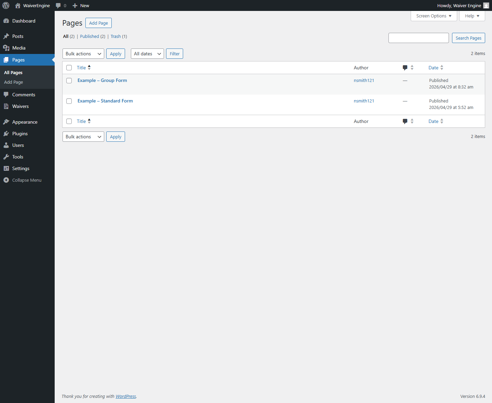
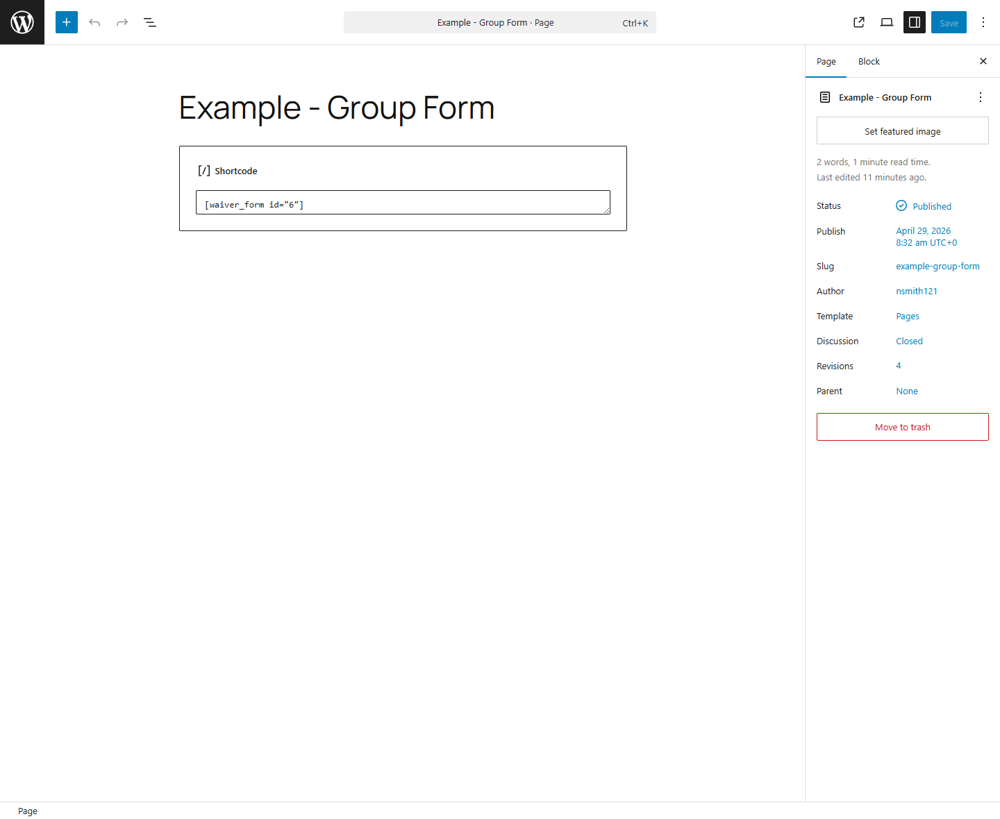
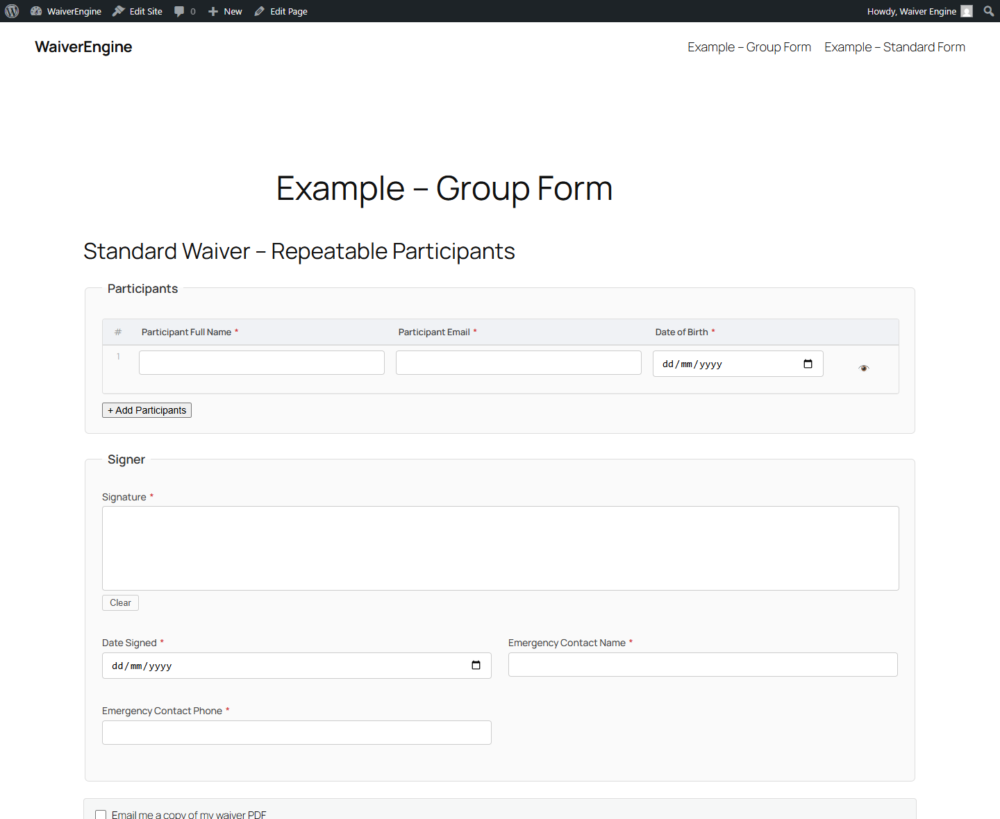
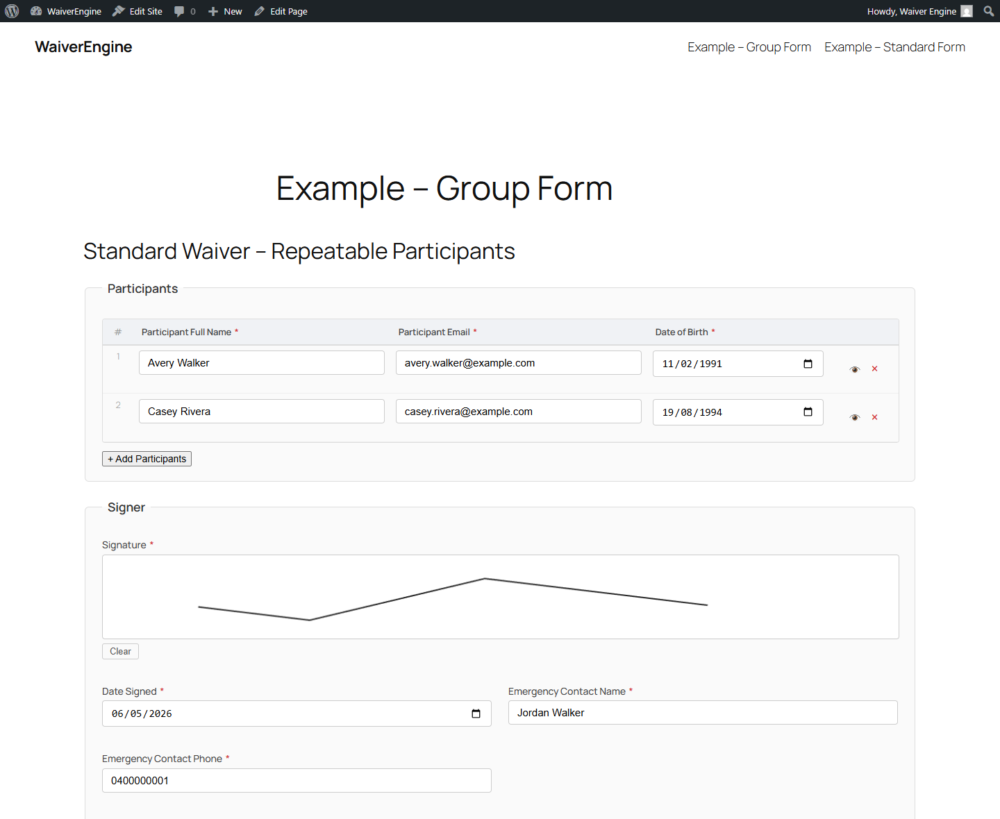
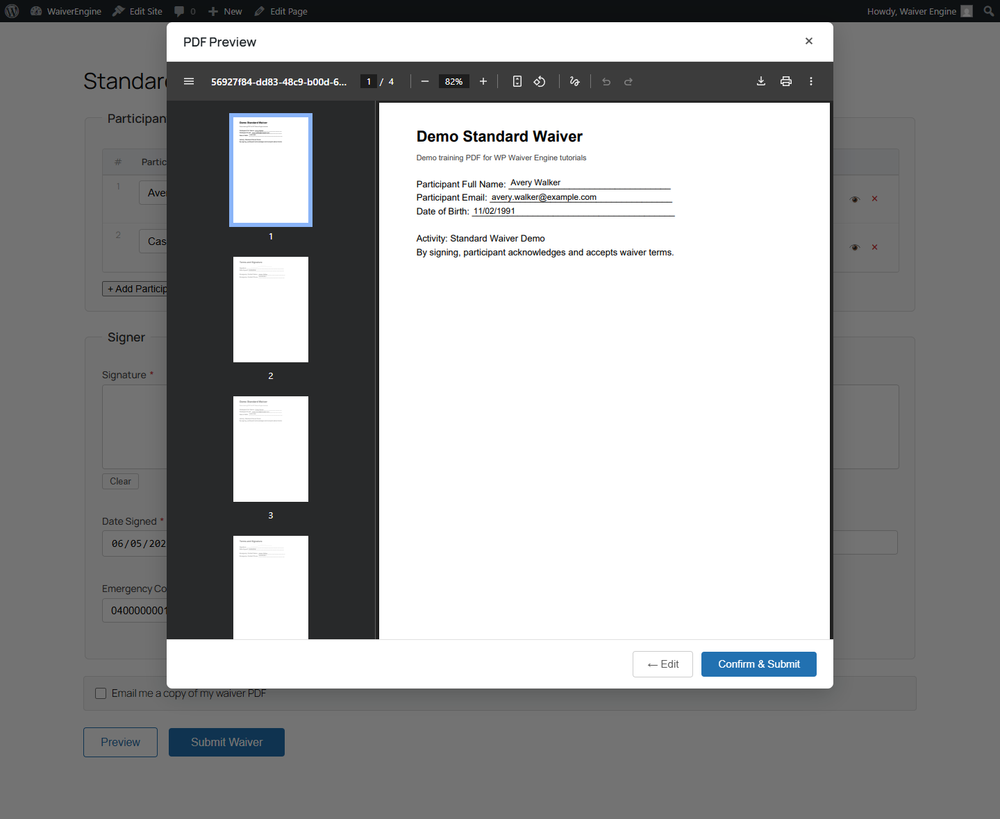
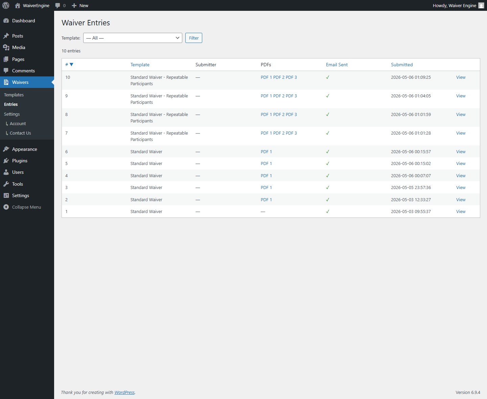
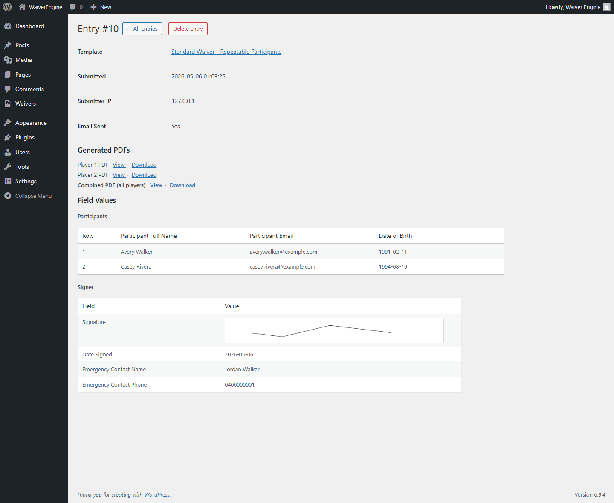

# Repeatable Family Form User Flow Guide

This guide covers the full user journey for the page "Example - Group Form" using the "Standard Waiver - Repeatable Participants" template.

It walks through:

1. Confirming the shortcode on the page
2. Opening the frontend repeatable form
3. Adding participant rows
4. Filling participant and signer details
5. Signing and previewing
6. Submitting the waiver
7. Viewing the submission in admin
8. Viewing generated per-participant and combined PDFs

## Prerequisites

- A repeatable template exists and is active (for example, "Standard Waiver - Repeatable Participants").
- The template output mode is `per_row`.
- The template output group key is `participants`.
- The page "Example - Group Form" exists in Pages.

## 1) Confirm the Waiver Form Shortcode on the Group Page

1. In wp-admin, go to Pages -> All Pages.
2. Open "Example - Group Form".
3. Confirm the shortcode block contains:

   [waiver_form id="6"]

4. Click Save/Update if any changes were made.
5. Click View Page to open the frontend.

Notes:
- If your template ID is different, use the ID shown in Waivers -> Templates.
- Example format: [waiver_form id="X"]

## 2) Open the Frontend Repeatable Form

1. Visit the group page URL.
2. Confirm the form renders with a repeatable Participants table.
3. Confirm the Add Participants button is available.

## 3) Add Participant Rows

1. In the Participants section, click + Add Participants.
2. Confirm an additional participant row appears.
3. Keep at least two rows to validate per-participant PDF generation.

## 4) Fill Participant and Signer Details

Complete the participant rows:

1. Participant Full Name
2. Participant Email
3. Date of Birth

Complete signer-level fields once:

1. Date Signed
2. Emergency Contact Name
3. Emergency Contact Phone

Date field note:
- Date inputs are browser date fields and typically expect YYYY-MM-DD when typed directly.

## 5) Preview the PDF

1. Click Preview.
2. In the PDF Preview modal, review the generated output.
3. Verify participant values and signature placement.

## 6) Submit the Form

1. In the preview modal, click Confirm & Submit.
2. Wait for the submission to complete.
3. In wp-admin, navigate to Waivers -> Entries.

## 7) View the Submission in Backend

1. Locate the newest row for the repeatable template.
2. Confirm there are multiple PDF links in the PDFs column.
3. Click View to open entry details.

On the entry details page, verify:
- Template name
- Submitted timestamp
- Participant row data
- Signer fields
- Generated PDFs list includes multiple files

## 8) View and Download Generated PDFs

From entry details:

1. In Generated PDFs, click View to open each PDF in browser.
2. Click Download for files you need to save.
3. Confirm you have per-participant files plus a combined output.

Expected result:
- One PDF is generated for each participant row.
- A combined PDF is also generated for the submission.
- All PDFs include mapped values and signature where applicable.