# Standard Waiver Use Case

This walkthrough shows how to create a single template named Standard Waiver.

It uses the demo-standard-waiver.pdf file as the base PDF and focuses on:

1. Creating the template
2. Opening the Visual Field Mapper
3. Dragging mapping boxes onto the actual PDF lines
4. Configuring the mapped fields
5. Using page 2 for the signature field

## 1) Create the template

1. Open Waiver Templates.
2. Click Add New.
3. Enter a title for this waiver.
4. Select your PDF waiver from your media library.
5. Save the template.

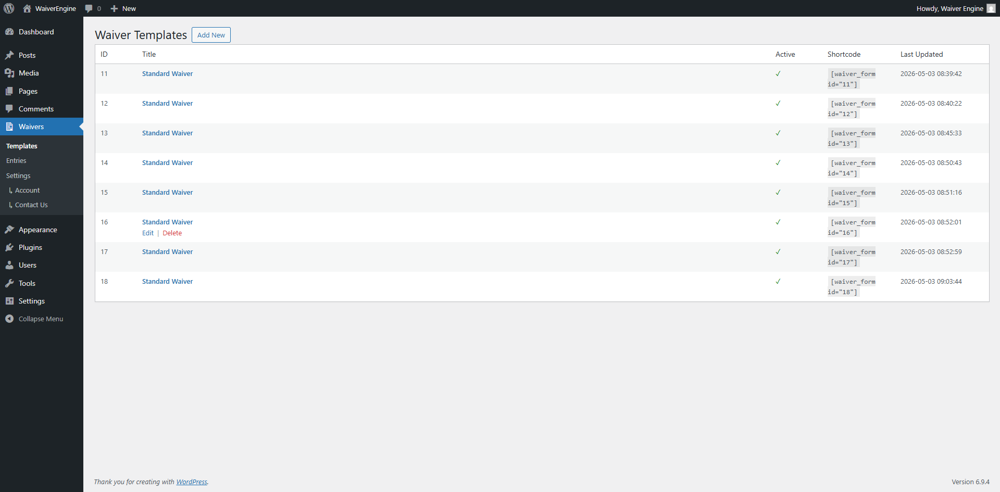
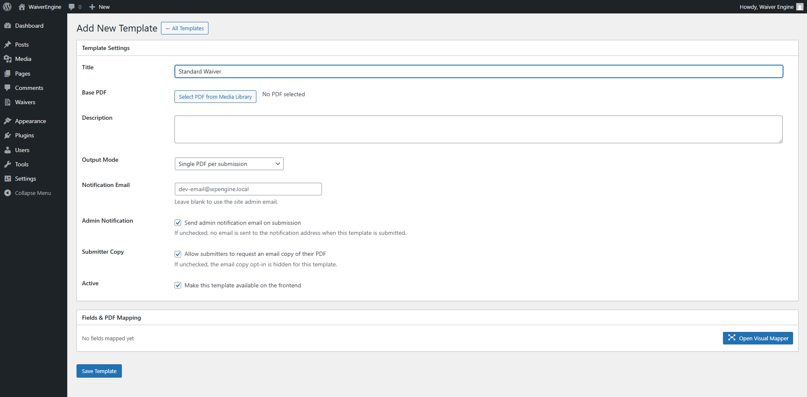
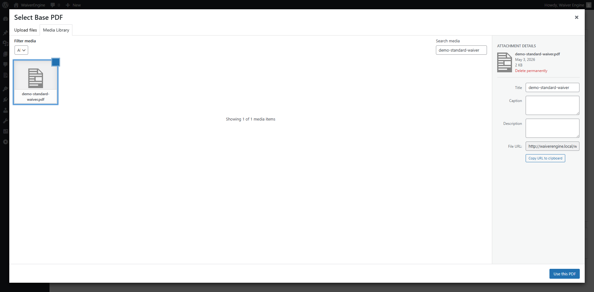
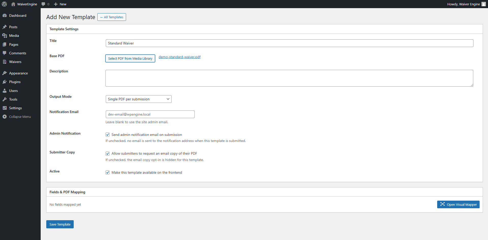
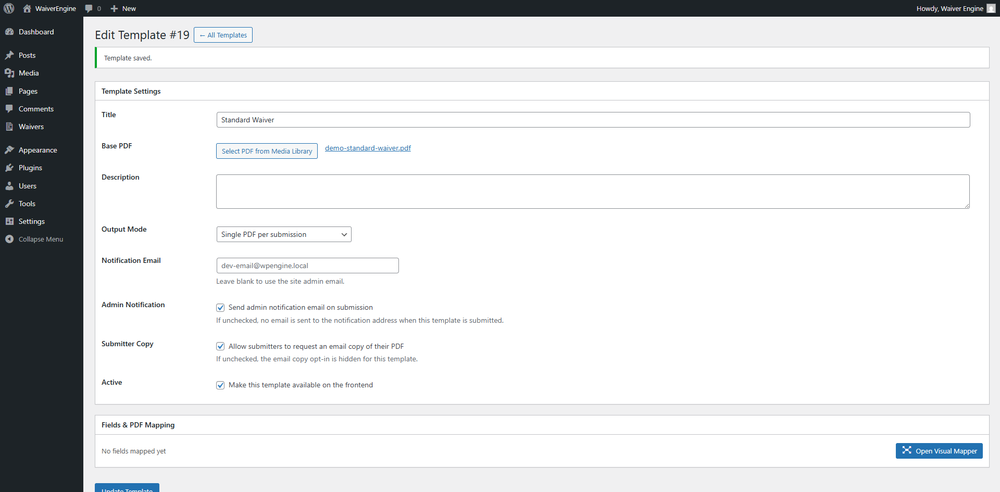

## 2) Open the Visual Mapper

1. Scroll to Fields & PDF Mapping.
2. Click Open Visual Mapper.
3. Confirm the mapper shows Pg 1/2, which means the PDF has multiple pages.

## 3) Map fields to the actual lines on page 1

This sample PDF has three printed entry lines on page 1:

1. Participant Full Name
2. Participant Email
3. Date of Birth

Click and drag directly over each printed line so the blue mapping box sits on top of the real field area.

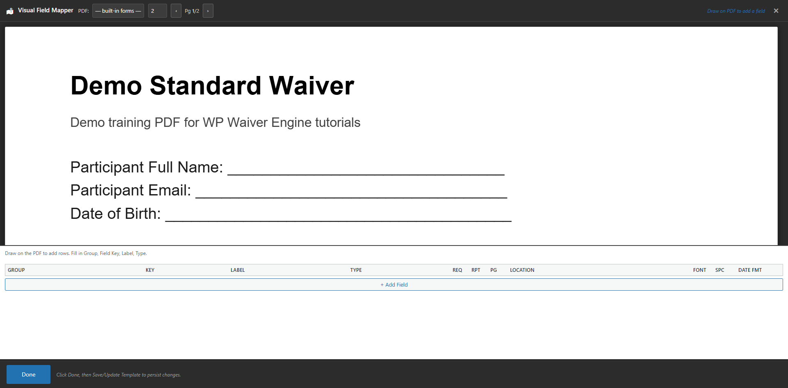
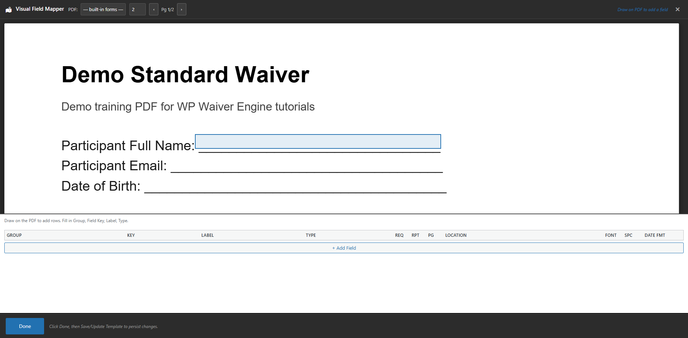
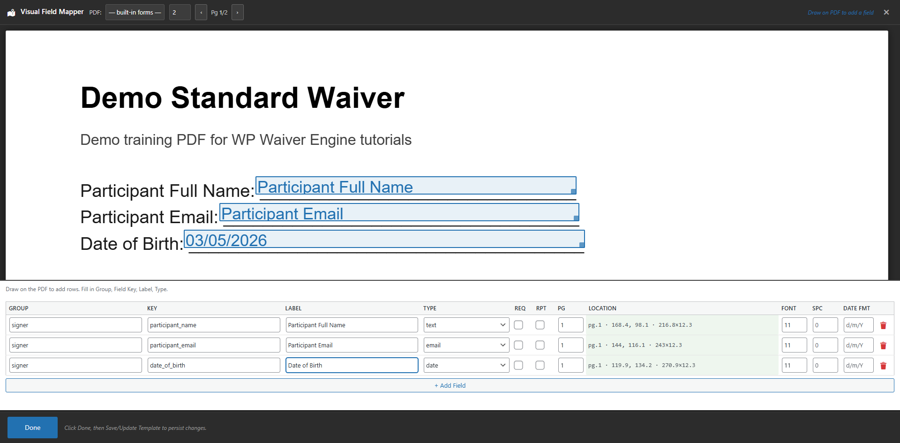

## 4) Field type guidance

After each box is created, configure the TYPE column for the field you are mapping.

Recommended setup for this simple example:

1. Participant Full Name: text
2. Participant Email: email
3. Date of Birth: date
4. Participant Signature: signature

The TYPE column controls whether each mapped row behaves as a text, email, date, or signature field.

The screenshot below shows the corrected aligned page 1 fields with the Group, Key, Label, and Type values filled in for the mapped rows.

## 5) Use page 2 for the signature example

Page 2 is shown separately using the Pg 1/2 navigation in the mapper header.

For this sample PDF, the signature field is mapped to the printed Signature line at the top of page 2.

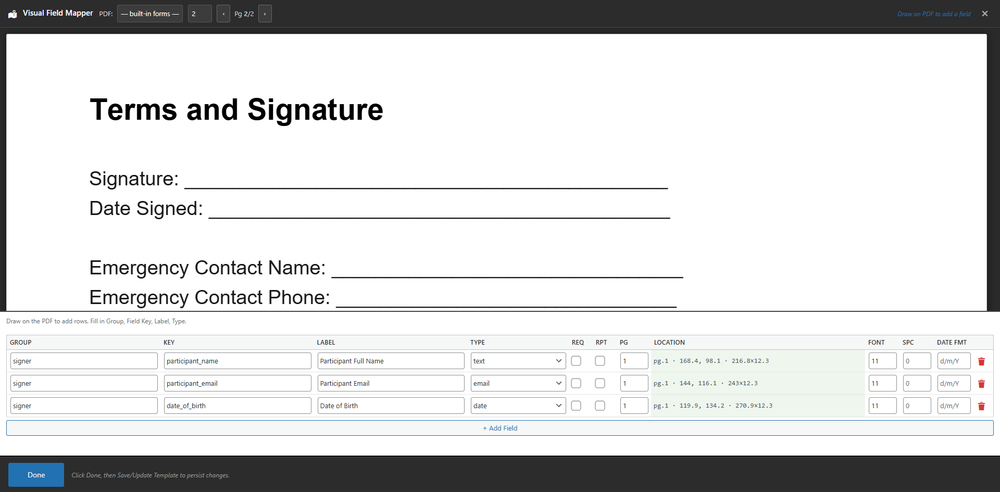
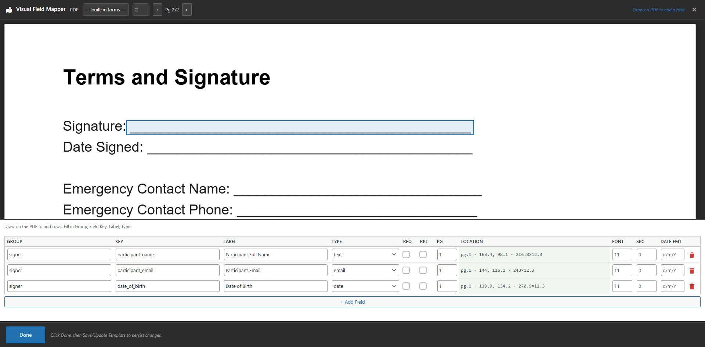
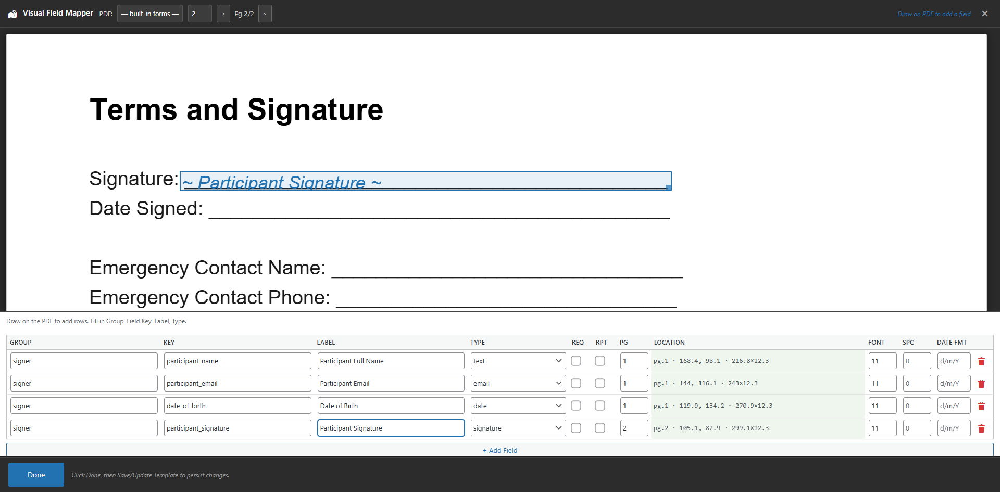
