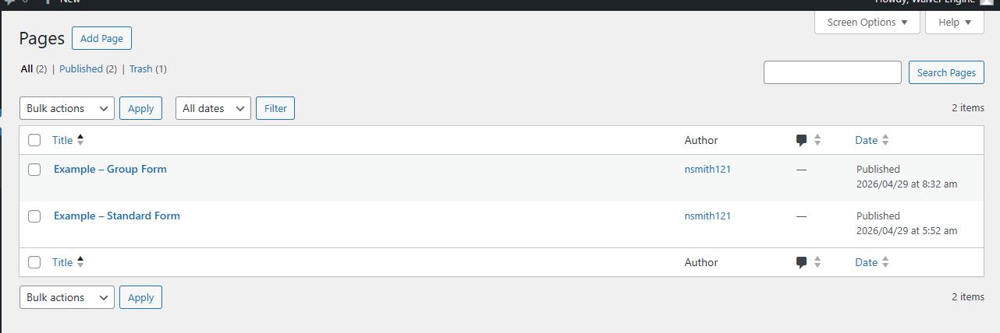
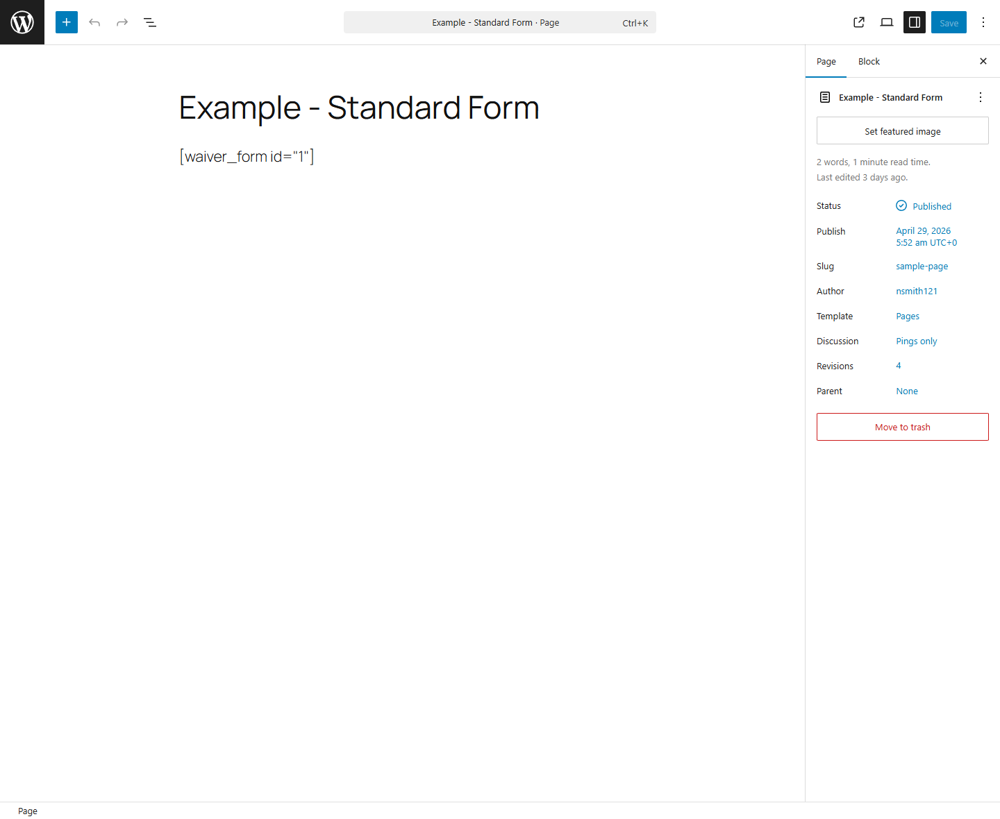
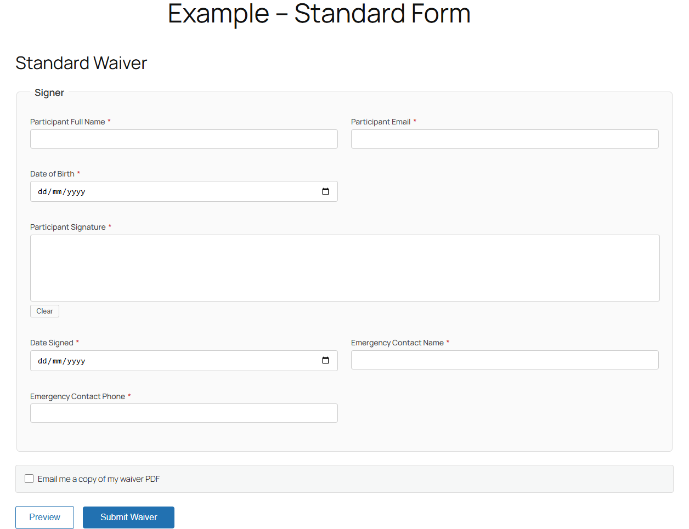
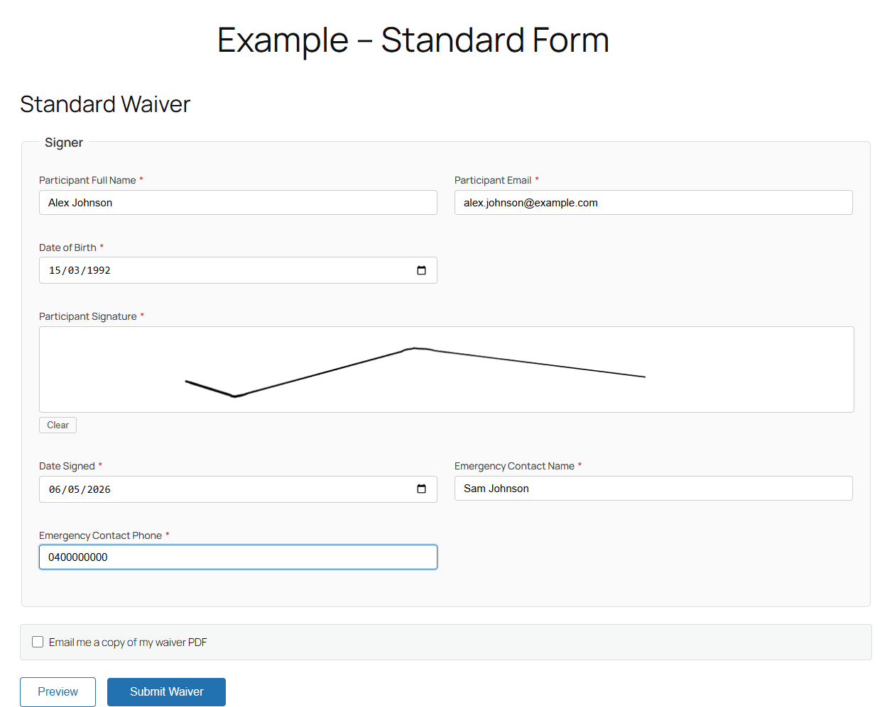
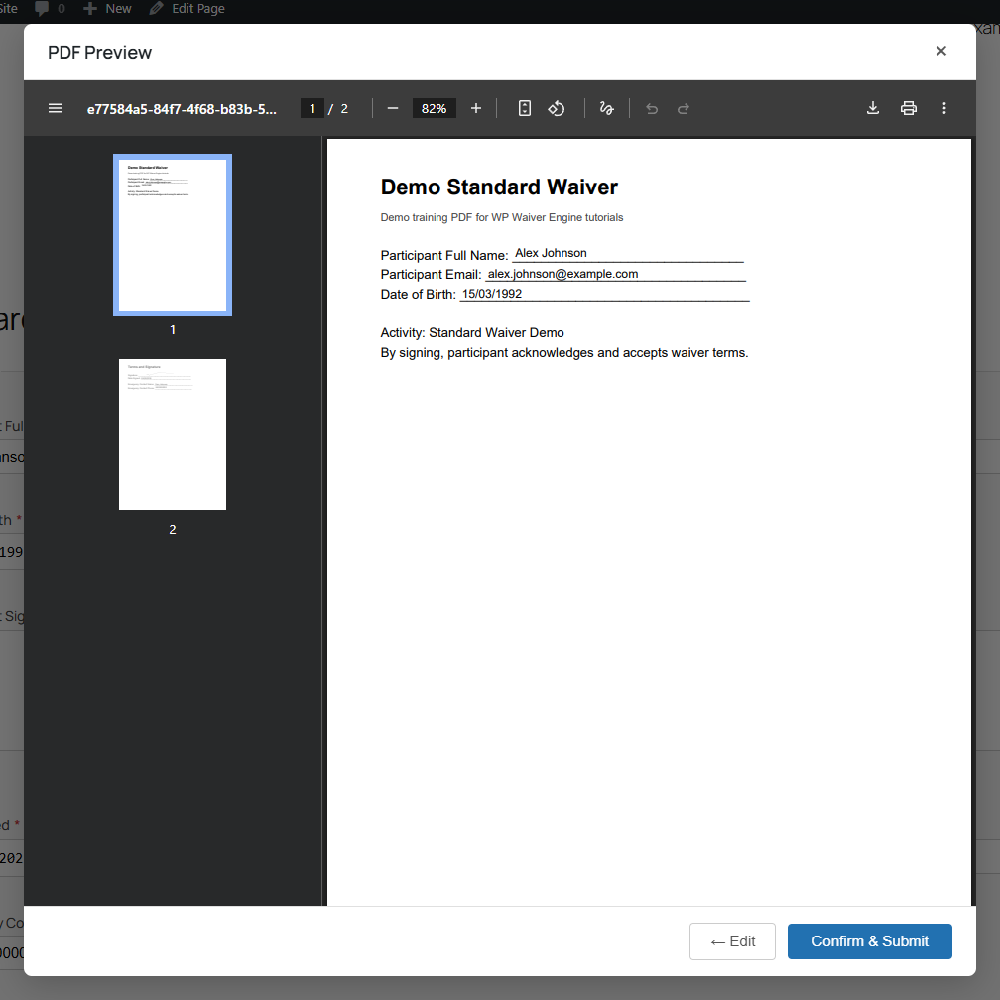
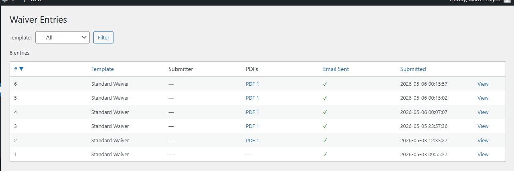
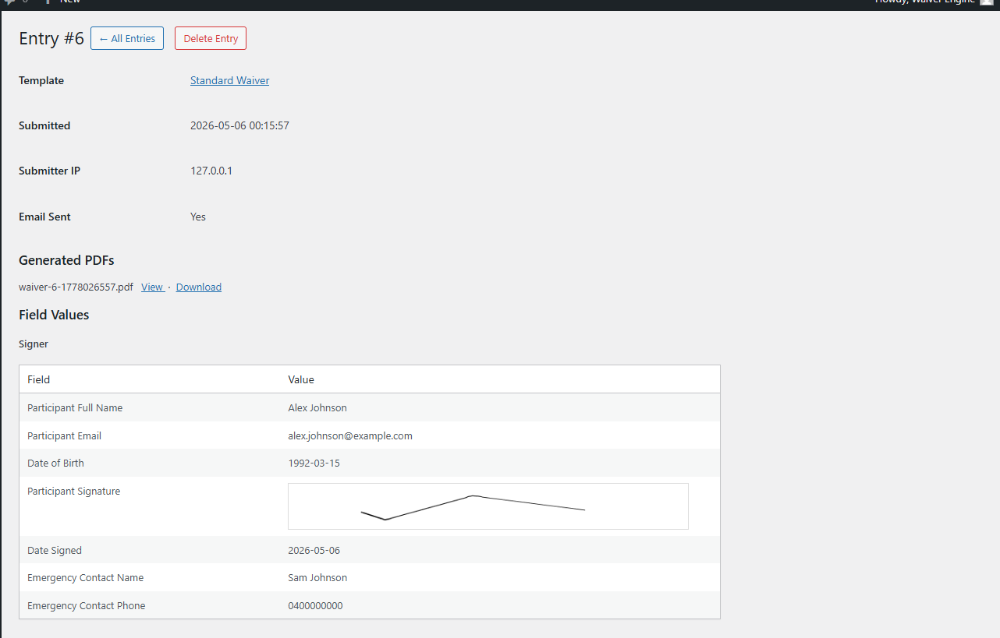

# Standard Form User Flow Guide

This guide covers the full user journey for the existing page "Example – Standard Form" using the Standard Waiver template.

It walks through:

1. Adding the shortcode to the page
2. Visiting the frontend waiver form
3. Filling out details
4. Signing the waiver
5. Previewing the PDF
6. Submitting the waiver
7. Viewing the submission in admin
8. Viewing and downloading the generated PDF

## Prerequisites

- A waiver template already exists and is active (for example, "Standard Waiver").
- The template has working field mapping and PDF generation.
- The page "Example – Standard Form" exists in Pages.

## 1) Add the Waiver Form Shortcode to the Page

1. In wp-admin, go to Pages -> All Pages.
2. Open "Example – Standard Form".
3. Add the shortcode in a paragraph block:

   [pewave_form id="1"]

4. Click Save/Update.
5. Click View Page to open the frontend.

Notes:
- If your template ID is different, use the shortcode shown in Waivers -> Templates.
- Example format: [pewave_form id="X"]

## 2) Open the Frontend Form as a User

1. Visit the published page URL (for example, /sample-page/).
2. Confirm the form renders under the page title and shows the waiver name (for example, "Standard Waiver").

## 3) Fill in the Form Details

Complete all required fields in the Signer group:

1. Participant Full Name
2. Participant Email
3. Date of Birth
4. Date Signed
5. Emergency Contact Name
6. Emergency Contact Phone

Date field note:
- Date inputs are browser date fields and typically expect YYYY-MM-DD when typed directly.
- You can also use the browser date picker.

## 4) Sign the Form

1. Draw a signature in the "Participant Signature" canvas area.
2. If needed, click Clear and sign again.

## 5) Preview the PDF

1. Click Preview.
2. In the PDF Preview modal, review the rendered PDF output.
3. Verify field values and signature placement.

## 6) Submit the Form

1. In the preview modal, click Confirm & Submit.
2. After submitting, confirm the form data was accepted by checking the entry in Waivers -> Entries.

## 7) View the Submission in Backend

1. In wp-admin, go to Waivers -> Entries.
2. Locate the newest row for your template.
3. Click View.

On the entry details page, verify:
- Template name
- Submitted timestamp
- Field values
- Signature image value

## 8) View and Download the Submitted PDF

From either location:

A) Entries list:
1. In Waivers -> Entries, click the PDF link in the PDFs column.

B) Entry details:
1. Open the entry (View).
2. In Generated PDFs, click View to open in browser.
3. Click Download to save the file.

Expected result:
- At least one generated PDF appears for a successful entry.
- The PDF opens and includes mapped values plus signature.
